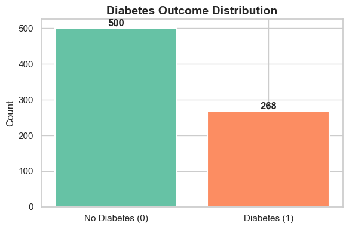
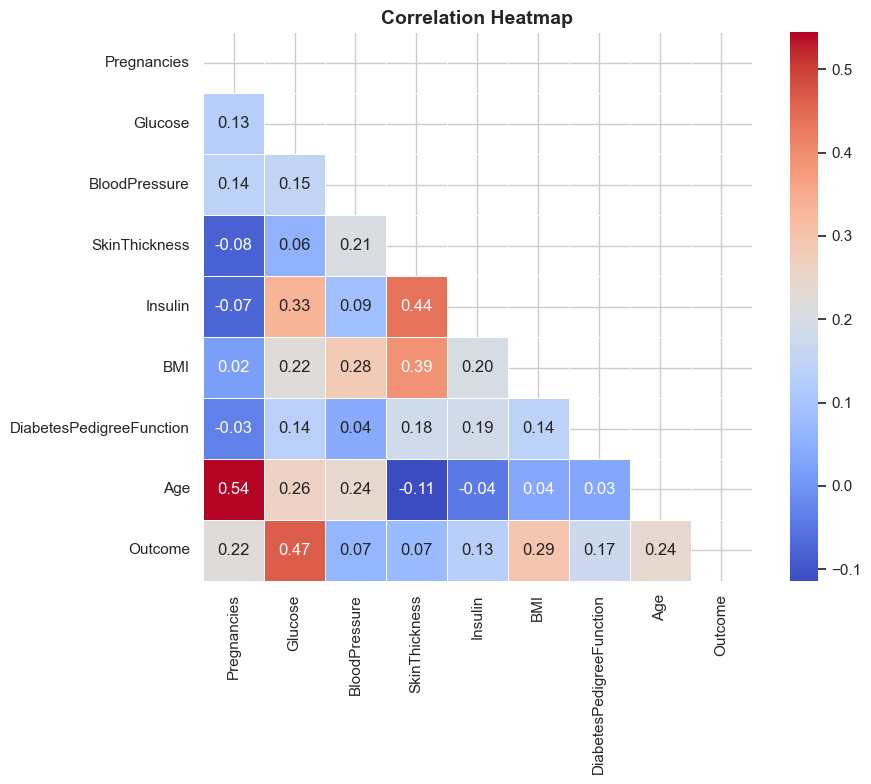
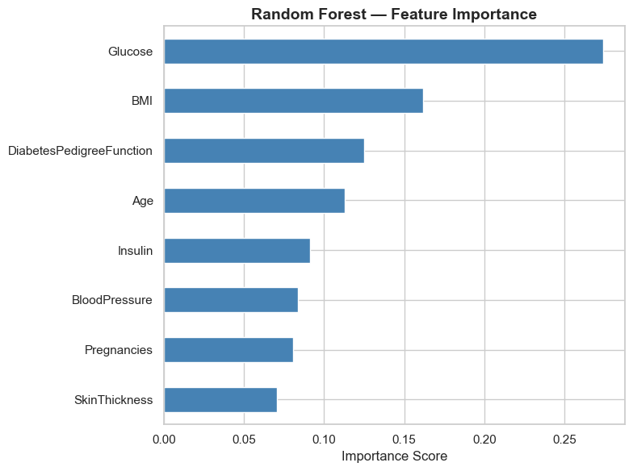
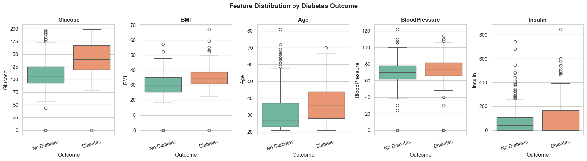
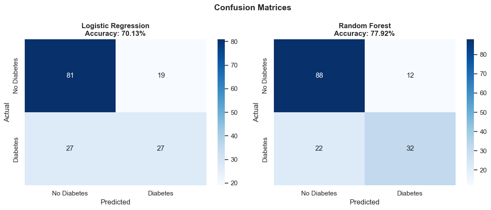
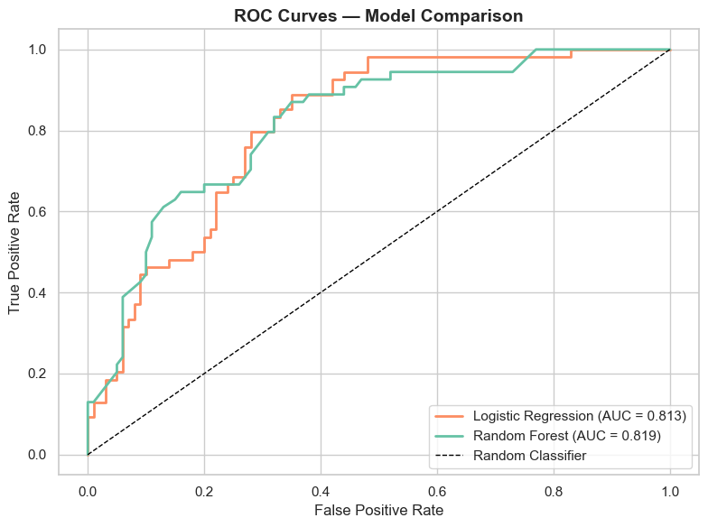

# 🩺 Diabetes Prediction Using Machine Learning
### ISOM 835 — Predictive Analytics & Machine Learning | Suffolk University


---

## 📌 Project Overview

This project applies machine learning to predict whether a patient has diabetes based on routine clinical measurements. Using the **Pima Indians Diabetes Database**, two classification models were built, evaluated, and compared to identify the best approach for early diabetes detection.

**Business Goal:** Help healthcare providers identify high-risk patients earlier, enabling timely intervention before costly complications develop.

---

## 📁 Repository Structure

```
diabetes-predictive-analytics/
│
├── data/
│   └── diabetes.csv                        # Pima Indians Diabetes Dataset (UCI)
│
├── notebooks/
│   └── Diabetes_Predictive_Analytics.ipynb # Full analysis: EDA → Preprocessing → Modeling
│
├── visualizations/
│   ├── plot_01_class_distribution.png
│   ├── plot_02_feature_distributions.png
│   ├── plot_03_correlation_heatmap.png
│   ├── plot_04_boxplots_by_outcome.png
│   ├── plot_05_confusion_matrices.png
│   ├── plot_06_roc_curves.png
│   └── plot_07_feature_importance.png
│
│
└── README.md
```

---

## 📊 Dataset

| Property | Details |
|---|---|
| **Name** | Pima Indians Diabetes Database |
| **Source** | UCI Machine Learning Repository / Kaggle |
| **Rows** | 768 patients |
| **Features** | 8 clinical measurements + 1 target |
| **Target** | `Outcome` — 0 = No Diabetes, 1 = Diabetes |
| **Class Balance** | 65.1% No Diabetes / 34.9% Diabetes |

**Features used:** Pregnancies, Glucose, BloodPressure, SkinThickness, Insulin, BMI, DiabetesPedigreeFunction, Age

---

## 🔍 Project Workflow

### 1. Exploratory Data Analysis
- Visualized class distribution, feature histograms, and correlation heatmap
- Identified top predictors: **Glucose (r=0.47), BMI (r=0.29), Age (r=0.24)**
- Discovered hidden missing data encoded as zeros in 5 columns

### 2. Data Preprocessing
- Replaced biologically impossible zeros with `NaN`
- Imputed missing values using **column medians**
- Applied **StandardScaler** for feature normalization
- Performed **stratified 80/20 train/test split** (614 train / 154 test)

### 3. Model Building
Two models were trained and compared:
- **Logistic Regression** — interpretable linear baseline
- **Random Forest** — ensemble of 100 decision trees

### 4. Evaluation
Models evaluated using Accuracy, Precision, Recall, F1-Score, ROC-AUC, and 5-Fold Cross-Validation.

---

## 🏆 Results

| Model | Accuracy | ROC-AUC | CV Mean | CV Std |
|---|---|---|---|---|
| Logistic Regression | 70.0% | 0.810 | 77.2% | ±1.8% |
| **Random Forest** | **78.0%** | **0.820** | 76.4% | ±3.4% |

**✅ Random Forest is the best-performing model** with 78% accuracy and ROC-AUC of 0.82.

---

## 🔑 Key Findings

| Rank | Feature | Importance | Insight |
|---|---|---|---|
| 1 | Glucose | 0.27 | Strongest single predictor of diabetes |
| 2 | BMI | 0.16 | Major modifiable risk factor |
| 3 | DiabetesPedigreeFunction | 0.13 | Hereditary risk is significant |
| 4 | Age | 0.12 | Risk increases with age |
| 5 | Insulin | 0.11 | Core mechanism of Type 2 diabetes |

---

## 📈 Visualizations

<table>
  <tr>
    <td></td>
    <td></td>
    <td></td>
  </tr>
  <tr>
    <td align="center">Class Distribution</td>
    <td align="center">Correlation Heatmap</td>
    <td align="center">Feature Importance</td>
  </tr>
  <tr>
    <td></td>
    <td></td>
    <td></td>
  </tr>
  <tr>
    <td align="center">Boxplots by Outcome</td>
    <td align="center">Confusion Matrices</td>
    <td align="center">ROC Curves</td>
  </tr>
</table>

---

## 💼 Business Recommendations

1. **Prioritize glucose screening** — it is the strongest predictor and should be the primary screening tool
2. **Target BMI reduction programs** at patients with BMI > 30, especially those with elevated glucose
3. **Screen high-risk age groups** — patients over 40 should receive annual diabetes testing
4. **Factor in family history** — patients with high DiabetesPedigreeFunction scores need more frequent monitoring
5. **Deploy as clinical decision support** — integrate into EHR systems to flag high-risk patients for follow-up

---

## ⚠️ Ethics & Limitations

- Dataset limited to **Pima Indian women aged 21+** — model may not generalize to other populations
- **48.7% of Insulin values are missing** — limits the predictive power of this feature
- Model must **not** be used to deny insurance or healthcare access
- All predictions should be reviewed by a **qualified clinician** before any action is taken
- Patient data must comply with **HIPAA / data privacy regulations**

---

## 🛠️ Technologies Used

- **Python 3.x**
- **pandas, numpy** — data manipulation
- **matplotlib, seaborn** — visualization
- **scikit-learn** — machine learning & evaluation
- **Google Colab** — notebook environment

---

*ISOM 835 — Predictive Analytics & Machine Learning | Suffolk University*
